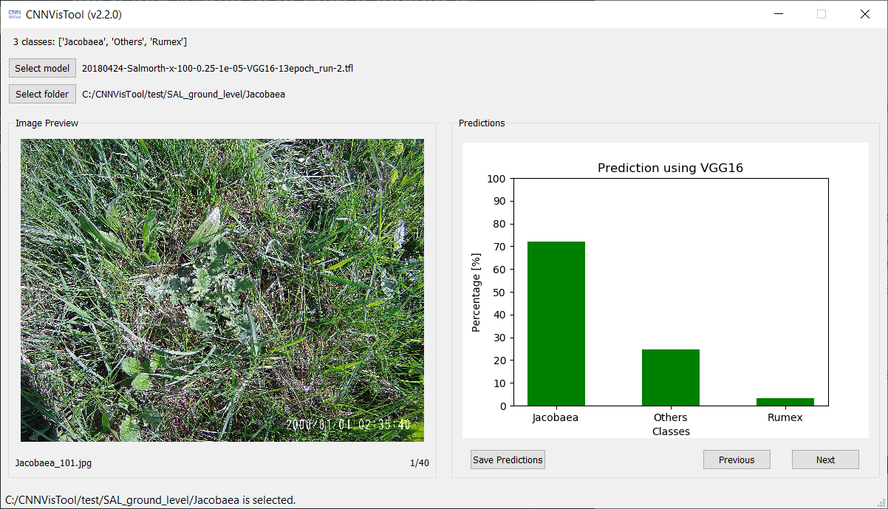

# CNNVisTool (Convolutional Neural Network Visualization Tool)
CNNVisTool (“Convolutional Neural Network Visualization Tool”) is an open source software written in Python 3 that allows users to load different trained convolutional neural network model for classifying images.

The software is designed to provide visualization chart to understand the output of the trained model, and to save the predictions for further analysis. And was originally designed for an image classifier trained to classify weed species in grassland, in order to assist volunteers and non-experts in recognizing any targeted weed species in the field.

# Functionality
CNNVisTool consists of the following features:

* Display the prediction outputs of a trained image classifier as bar chart
* Select trained model, display the selected model name, and the number of classes together with the class names which are automatically loaded from the corresponding text file
* Select folder with images, display the selected folder name, and the first image together with the image name
* Save prediction outputs for all images into a text file
* Navigate images within the selected folder for prediction
* Display the position of the displayed image in the selected folder

Note that currently only VGG16 model trained with TFlearn (TensorFlow) is supported.

# Development Environment
CNNVisTool is developed using Python 3.6.5 and virtualenv 16.0.0. Inside the virtualenv, packages such as TensorFlow, TFlearn and PyQt were installed. A list of the installed packages has been provided as "``requirements.txt``" in the repository. The entire virtual environment is also provided in the ``.zip`` file in the Release page.

# Example Model and Data
Two example trained model and some test data have been provided in the Release page. The provided data was collected at a nature reserve known as Salmorth, near Kleve, in Germany.

| Example 1 | Size | Description |
|-----------|------|-------------|
| 20180424-Salmorth-x-100-0.25-1e-05-VGG16-13epoch_run-2.tfl | 744 MB | Trained for ground level weed species classification, targeting _Senecio jacobaea_ and _Rumex obtusifolius_ |
| SAL_ground_level | 1.12 GB | Ground level data including 40 images of _Senecio jacobaea_, 80 images of _Rumex obtusifolius_ and 100 images of other vegetation |

| Example 2 | Size | Description |
|-----------|------|-------------|
| 20190606-Salmorth_UAV-200-100-0.2-1e-05-VGG16-20epoch_run-1.tfl | 744 MB | Trained for UAV level weed species classification, targeting _Rumex obtusifolius_ |
| SAL_UAV_level | 9.20 MB | UAV level data including 20 images of _Rumex obtusifolius_ and 100 images of other vegetation |

# Acknowledgement
The software CNNVisTool is developed within the scope of the SPECTORS Project, a Dutch-German cooperation project funded by INTERREG V-A Deutschland-Nederland (project number 143081).

# Publications
The provided example trained models and test data were used in the following publications:

* Lam, O. H. Y.; Melville, B.; Dogotari, M.; Prüm, M.; Vithlani, H.N.; Roers, C.; Becker, R.; Zimmer, F. (2019): Mapping Invasive _Rumex obtusifolius_ in Grassland Using Unmanned Aerial Vehicle. _Proceedings_, 30(1), pp. 34. doi: https://doi.org/10.3390/proceedings2019030034
* Lam, O. H. Y.; Melville, B.; Dogotari, M.; Prüm, M.; Vithlani, H. N.; Roers, C.; Becker, R.; Zimmer, F. (2019): Mapping of _Rumex obtusifolius_ in Native Grassland using Unmanned Aerial Vehicle: From Object-based Image Analysis to Deep Learning [Abstract]. In : 39th Annual EARSeL Symposium. DIGITAL | EARTH | OBSERVATION. 39th Annual EARSeL Symposium. Salzburg, Austria, 1-4 July, 2019. Available online: http://symposium.earsel.org/39th-symposium-Salzburg/wp-content/uploads/2019/07/EARSeL-2019-Book-of-Abstracts-Print.pdf (Access on 24 December 2019)
* Lam, O. H. Y.; Melville, B.; Dogotari, M.; Prüm, M.; Roers, C.; Becker, R.; Zimmer, F. (2018): Detection of invasive weed species in grasslands using UAV RGB-imagery [Abstract]. In : 3rd Annual UAS4RS. UAS4RS 2018 (Unmanned Aircraft Systems for Remote Sensing) Conference. Melbourne, Australia, 5-6 December, 2018.

# License
© Copyright 2019, Olee Hoi Ying Lam. License under [GNU GPLv3](https://github.com/oleelamhy/CNNVisTool/blob/master/LICENSE).
